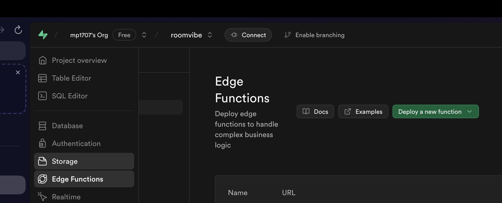

# Edge Functions

This folder contains copies of supabase edge functions to help you get started quickly. With the latest updates from Supabase, you can now create and manage edge functions directly within the Supabase editor, eliminating the need for a local Deno environment. Additionally, AI-powered assistance is available to streamline the development process.

https://supabase.com/dashboard/project/YOUR_PROJECT/functions/YOUR_EDGE_FUNCTION

